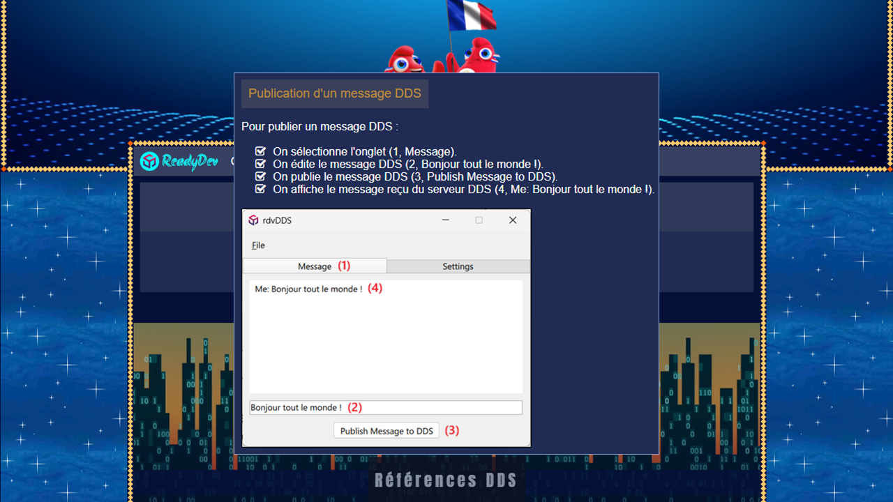

**DDS (Data Distribution Service)** est un middleware réseau
qui simplifie la programmation réseau complexe.
Il implémente un modèle de publication-abonnement pour l'envoi
et la réception de données, d'événements et de commandes entre les nœuds.
Les nœuds producteurs d'informations (éditeurs) créent des « sujets »
(par exemple, température, localisation, pression)
et publient des « échantillons ».

Dans ce tutoriel, vous apprendrez à communiquer des données
à travers le réseau **DDS** fournit par la librairie **RTI Context**
dans un environnement **C++** interfacé avec la librairie **Qt/QML**.

[Tutoriel](https://readydev.ovh/home/tutoriels/cpp/references-dds "Suivre le tutoriel sur ReadyDEV") |
[Contact](https://www.linkedin.com/in/tia-gerard-kesse/ "Contactez-moi sur LinkedIn")

